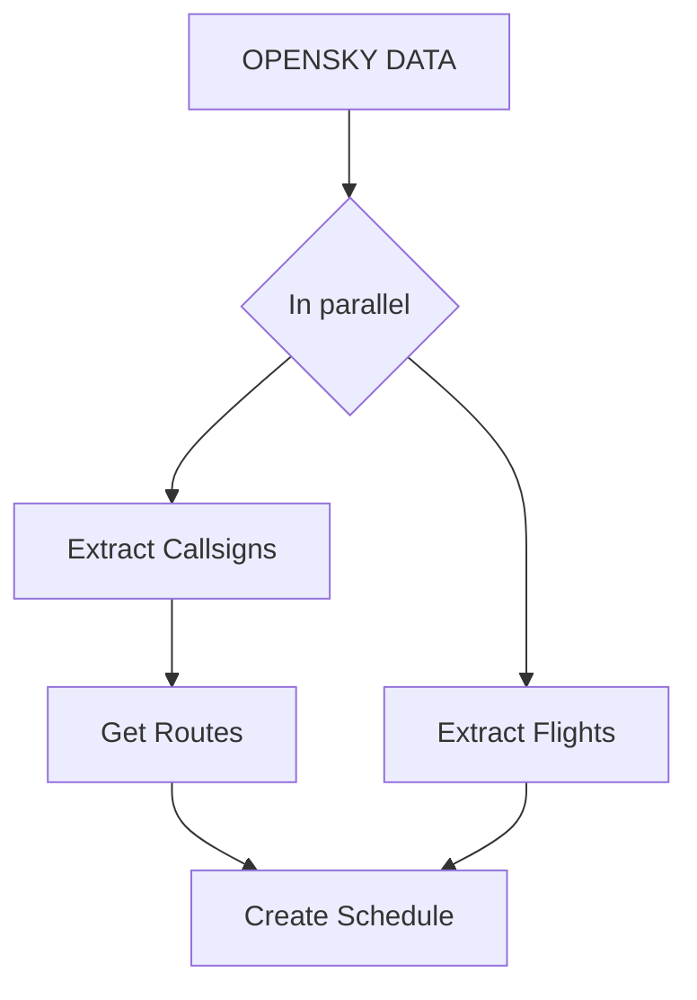

# SKYSHARK TOOLSET

The **SKYSHARK TOOLSET** allows you to download states (flight tracking data) from [OpenSky Network](https://opensky-network.org/) and create your own flight schedule for this benchmark.

All tools read from or write to ```./data```. The downloader tool creates the folder if it does not exist.
The default settings for each tool take this into account.


## Installation

We recommend using virtual environments to install the dependencies.
You need python 3.9 or above.


```
git clone https://github.com/skysharkBenchmark/skyshark
cd skyshark
pip install -r requirements.txt
```


## Order of Use

Below we describe the order in which you should use our tools to collect the ``states`` from OpenSky and create your own ``flight schedule``.




## OPENSKY DATA

We recommend using the Impala (Trini) Shell or the pre-collected datasets provided by OpenSky. 
If you need larger datasets you can contact OpenSky directly. 


## EXTRACT CALLSIGNS

This tool extracts the unique callsigns within the ```states.csv``` file. These are later used to identify the flights within the dataset.

### How to use

```
python3 extract_callsigns -i [input file states.csv] -o [output file callsigns.csv]
```


## GET ROUTES

This tool extracts the flights stored in OpenSky. Sometimes it needs multiple runs to find all flights. You can use the callsigns that did not match to start a new run.

### How to use

```
python get_routes -i [input file callsigns.csv] -o [output folder ./data]
```

This tool creates two files:
- ```./data/routes.csv``` contains all flights found in OpenSky.
- ```./data/no_routes.csv``` contains all callsigns where no flights could be found.


## EXTRACT FLIGHTSa

This tool iterates through all states collected in ```states.csv``` and identifies all flights available.
It does this by identifying the start of a flight when the state attribute on_ground changes from true to false.
The end of the flight is determined vice versa.

```
python extract_flights -i [input file states.csv] -o [output file flights.csv]
```


## CREATE SCHEDULE

This tool creates an SQLite database and imports the flights and routes created in previous steps. These two tables are than joined to create the flight schedule.

```
python create_schedule -r [path to routes.csv] -f [path to flights.csv] -o [output file schedule.csv]
```
